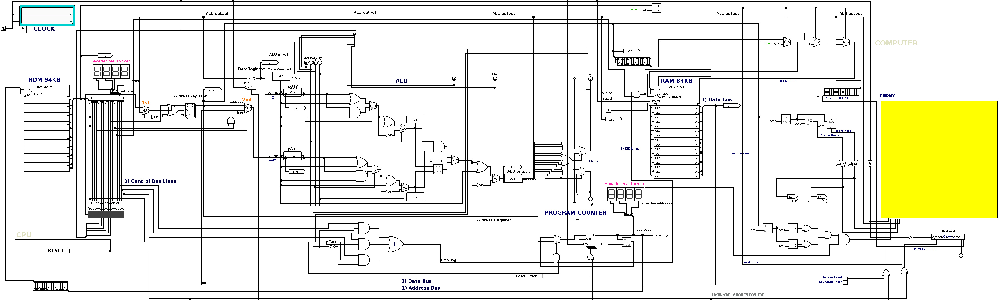
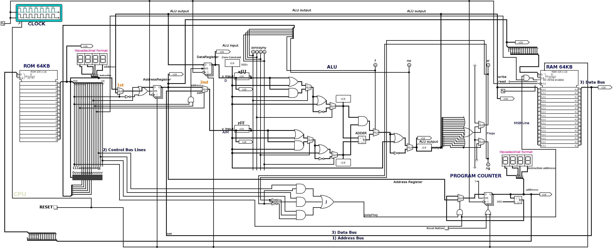
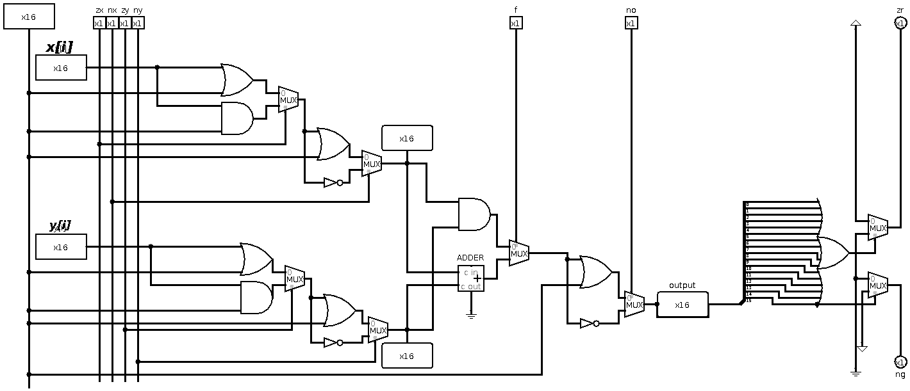
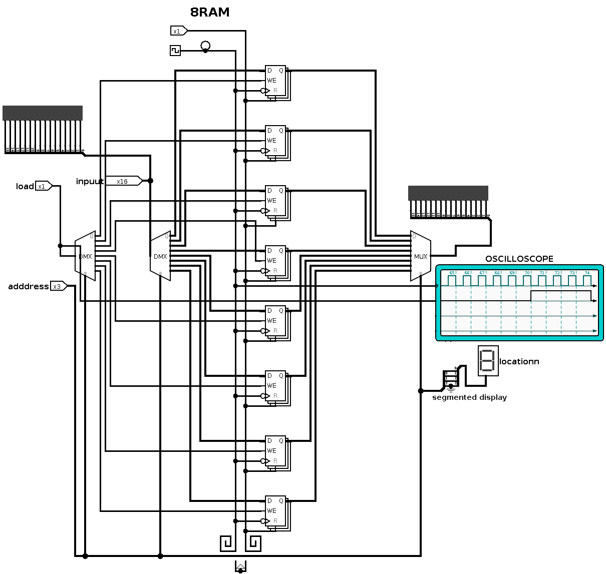
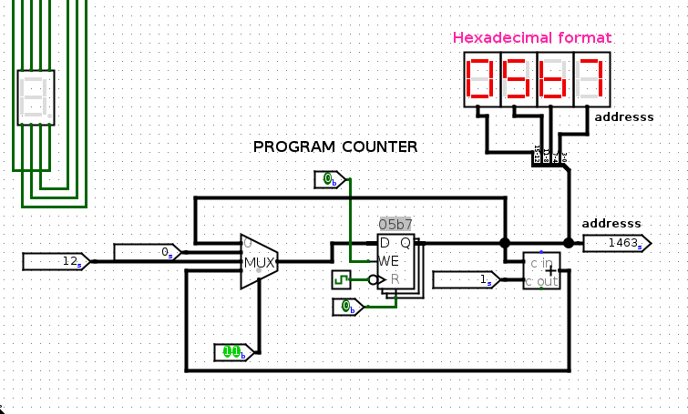
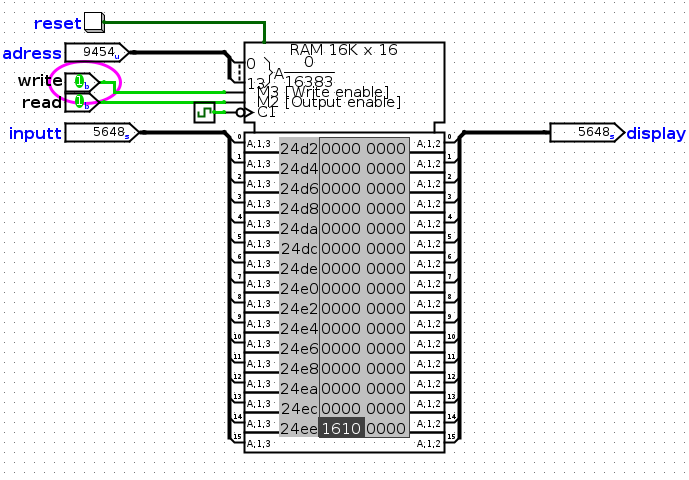
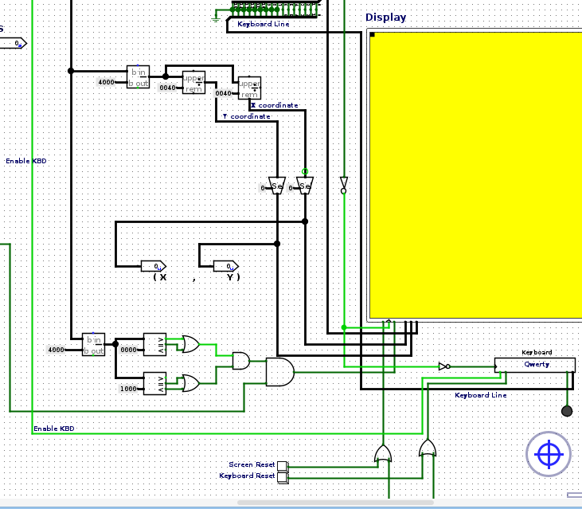
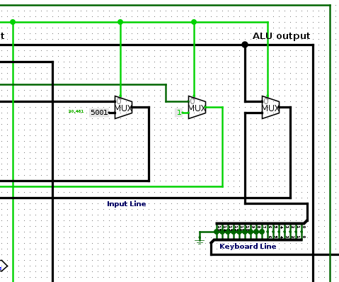

# MODERN DAY COMPUTING SYSTEM

<p align="center">
  
</p>

<h1 align="center">MODERN DAY COMPUTING SYSTEM</h1>

<p align="center">
  A complete 16-bit computer architecture built from scratch using digital logic, hardware simulation, assembly language, and low-level systems design.
</p>

<p align="center">
  
  
  
  
  
</p>

---

# About The Project

This project is a deep exploration into how computers actually work internally.

Instead of treating the computer as a black box, this repository focuses on building an entire computing system from the ground up:

* Logic Gates
* Arithmetic Units
* CPU Design
* Memory Systems
* Instruction Execution
* Assembly Language
* Hardware Simulation
* Memory-Mapped I/O

The project is heavily inspired by:

* The Elements of Computing Systems
* classical computer engineering
* low-level architecture design
* educational hardware projects

---

# Project Goals

* Build a fully functional 16-bit computer architecture
* Understand instruction execution at hardware level
* Design memory systems from scratch
* Implement a custom assembler
* Explore framebuffer and display systems
* Experiment with keyboard I/O
* Learn how software communicates with hardware
* Build a foundation for future OS development

---

# System Architecture

```text
                    ┌─────────────────────┐
                    │  Assembly Programs  │
                    └──────────┬──────────┘
                               │
                               ▼
                    ┌─────────────────────┐
                    │   Java Assembler    │
                    └──────────┬──────────┘
                               │
                               ▼
                    ┌─────────────────────┐
                    │    Machine Code     │
                    └──────────┬──────────┘
                               │
                               ▼
┌──────────────────────────────────────────────────────────┐
│                          CPU                             │
│                                                          │
│   ┌────────────┐     ┌────────────┐     ┌────────────┐   │
│   │ Registers  │────▶│    ALU     │────▶│ Jump Logic │   │
│   └────────────┘     └────────────┘     └────────────┘   │
│                                                          │
└──────────────────────────┬───────────────────────────────┘
                           │
          ┌────────────────┴────────────────┐
          ▼                                 ▼
┌──────────────────┐          ┌────────────────────────┐
│       RAM        │          │   Memory Mapped I/O    │
│                  │          │  Screen / Keyboard     │
└──────────────────┘          └────────────────────────┘
```

---

# Repository Structure

```text
.
├── ALU/                  # Arithmetic Logic Unit implementation
├── Assembler/            # Java-based assembler
├── assembly_programs/    # Assembly language programs
├── Backup/               # Backup circuit designs
├── Books/                # Reference books and PDFs
├── COMPUTER/             # Complete computer model
├── Course Work/          # Academic work and poster
├── CPU/                  # CPU architecture and debugging
├── Keyboard/             # Keyboard subsystem visuals
├── Libraries/            # External Logisim libraries
├── MEMORY/               # RAM and memory architecture
├── Screen/               # Display subsystem
├── README.md
└── refrences.txt
```

---

# Core Components

# CPU

The CPU is responsible for:

* instruction decoding
* arithmetic execution
* jump control
* register management
* memory interaction

### CPU Design

<p align="center">
  
</p>

---

# Arithmetic Logic Unit (ALU)

The ALU performs arithmetic and logical operations on 16-bit values.

### Includes

* 16-bit Adder
* Multiplexers
* Arithmetic circuits
* Logic operation units

<p align="center">
  
</p>

---

# Memory Architecture

The memory subsystem contains multiple RAM implementations and addressing logic.

<p align="center">
  
</p>

# Program Counter

The program counter tells the ROM which instruction to fetch hence implementing jump logic.

<p align="center">
  
</p>

### Features

* 8 RAM architecture
* 64KB ROM & RAM design
* Program Counter
* Registers
* Address decoding
* Synchronization experiments

<p align="center">
  
</p>

---

# Assembler

A custom assembler written in Java converts assembly instructions into executable machine code.
Put your .asm code in Code.asm file and then run the assembler and then run the hexadecimal converter for logisim. You can also run test scripts.

### Main Files

```text
Assembler.java
HexaDecimalConverter.java
TestScript.java
```

### Features

* Assembly parsing
* Binary instruction generation
* Hex conversion
* ROM-ready output generation

### Compile

```bash
cd Assembler
javac Assembler.java
```

### Run

```bash
java Assembler > output.hack
```

---

# Assembly Programs

The repository contains multiple low-level programs for testing the architecture.

| Program             | Description                   |
| ------------------- | ----------------------------- |
| `bitmap.asm`        | Bitmap graphics experiments   |
| `fibonacci.asm`     | Fibonacci sequence            |
| `keyboard.asm`      | Keyboard interaction          |
| `MAX.asm`           | Maximum value computation     |
| `RGB.asm`           | RGB framebuffer testing       |
| `pointer_array.asm` | Pointer and array experiments |
| `rom_execution.asm` | ROM execution testing         |

---

# Display & I/O Experiments

The project also explores:

* framebuffer concepts
* screen memory mapping
* RGB graphics
* keyboard interfacing
* unconventional synchronization techniques

<p align="center">
  
</p>

---

# Keyboard Model

<p align="center">
  
</p>

---

# Technologies Used

| Technology        | Purpose                  |
| ----------------- | ------------------------ |
| Logisim           | Hardware simulation      |
| Java              | Assembler implementation |
| Assembly Language | Low-level programming    |
| Digital Logic     | Hardware architecture    |

---

# Learning Objectives

This repository is designed to teach and explore:

* computer architecture
* digital electronics
* CPU execution cycles
* memory systems
* machine code
* assembly language
* memory mapped I/O
* hardware-software interaction

---

# Books & References

### Primary References

* The Elements of Computing Systems
* Digital Computer Electronics

---

# Getting Started

## Requirements

* Java JDK
* Logisim

---

## Clone Repository

```bash
git clone https://github.com/MODERN-DAY-COMPUTING-SYSTEM/PROJECT.git
```

---

## Open Circuits

Use Logisim-Evolution to open `.circ` files.

Example:

```bash
logisim-evolution CPU/CPU.circ
logisim-evolution ALU/adder.circ
logisim-evolution MEMORY/RAM32kB.circ
```

---

# Future Development

Planned improvements include:

* VGA-style video output
* Faster system 
* hardware debugger improvements
* keyboard buffering
* custom instruction extensions
* simple operating system experiments
* compiler backend exploration
* graphics acceleration concepts

---

# Why Build A Computer From Scratch?

Because understanding modern computing requires understanding what happens underneath:

* how instructions are executed,
* how memory stores data,
* how CPUs communicate internally,
* how displays are rendered,
* and how software becomes electrical activity.

This project exists to explore computing at its lowest meaningful level.

---

# Contributing

Contributions are welcome.

Areas where contributions would help:

* circuit optimization
* documentation
* graphics subsystem
* debugging tools
* assembly examples
* architecture improvements

---

# Acknowledgements

Inspired by:

* Nand2Tetris
* low-level systems engineering communities
* classic computer architecture literature

# License

This project is licensed under the MIT License.

Feel free to use, study, modify, and distribute this project for educational and research purposes.

---
<p align="center">
  <b>Author : Dhruv Sud</b>
</p>
